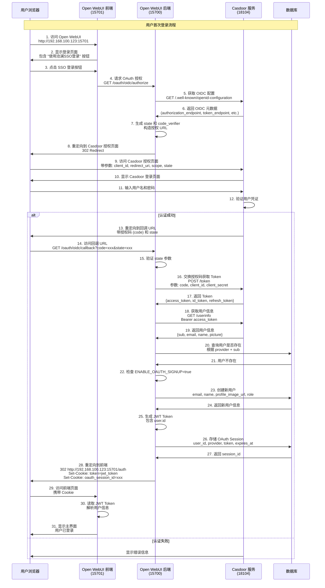
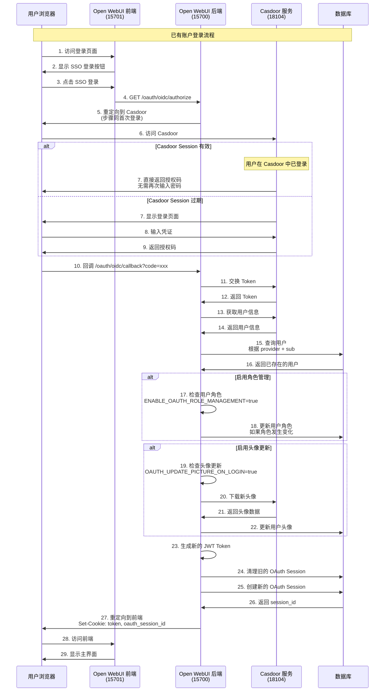
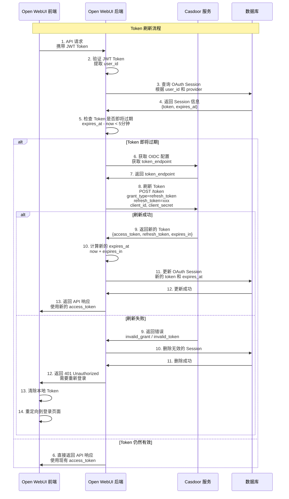
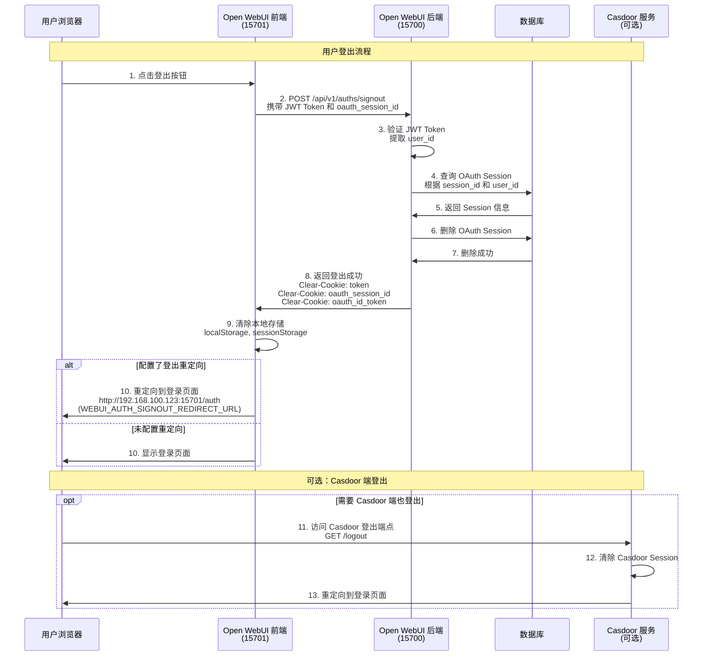
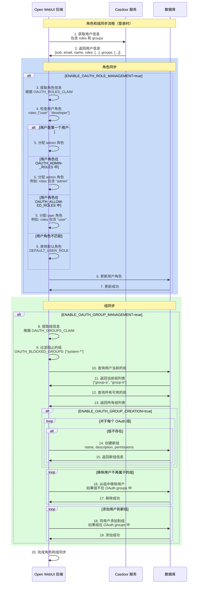
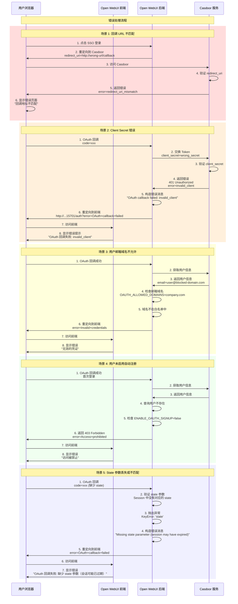

# Casdoor 单点登录时序图

本文档详细展示了 Open WebUI 与 Casdoor 集成的各种 OAuth/OIDC 流程时序图。

## 目录

- [1. 首次登录流程（OAuth 授权码流程）](#1-首次登录流程oauth-授权码流程)
- [2. 已有账户登录流程](#2-已有账户登录流程)
- [3. Token 刷新流程](#3-token-刷新流程)
- [4. 登出流程](#4-登出流程)
- [5. 角色和组同步流程](#5-角色和组同步流程)
- [6. 错误处理流程](#6-错误处理流程)

---

## 1. 首次登录流程（OAuth 授权码流程）

这是用户第一次通过 Casdoor 登录 Open WebUI 的完整流程，使用 OAuth 2.0 授权码模式。



### 关键步骤说明

| 步骤 | 说明 | 涉及配置 |
|------|------|----------|
| 5-6 | 获取 OIDC 配置 | `OPENID_PROVIDER_URL` |
| 9 | 授权请求参数 | `OAUTH_CLIENT_ID`, `OPENID_REDIRECT_URI`, `OAUTH_SCOPES` |
| 16 | Token 交换 | `OAUTH_CLIENT_ID`, `OAUTH_CLIENT_SECRET` |
| 18-19 | 获取用户信息 | `OAUTH_EMAIL_CLAIM`, `OAUTH_USERNAME_CLAIM` |
| 22-24 | 自动注册用户 | `ENABLE_OAUTH_SIGNUP` |
| 28 | 重定向到前端 | `WEBUI_URL` |

---

## 2. 已有账户登录流程

用户已经在 Open WebUI 中有账户，通过 Casdoor 再次登录的流程。



### 关键差异

- **步骤 16**：用户已存在，不需要创建新账户
- **步骤 17-18**：如果启用角色管理，会更新用户角色
- **步骤 19-22**：如果启用头像更新，会同步最新头像
- **步骤 24-25**：清理旧 Session，创建新 Session

---

## 3. Token 刷新流程

当 Access Token 即将过期时，使用 Refresh Token 获取新的 Access Token。



### 刷新策略

- **触发时机**：Token 过期前 5 分钟自动刷新
- **刷新方式**：使用 Refresh Token 向 Casdoor 请求新的 Access Token
- **失败处理**：如果刷新失败，删除 Session 并要求用户重新登录

---

## 4. 登出流程

用户主动登出 Open WebUI 的流程。



### 登出说明

1. **Open WebUI 端登出**：
   - 删除数据库中的 OAuth Session
   - 清除浏览器 Cookie（token, oauth_session_id）
   - 清除前端本地存储

2. **Casdoor 端登出**（可选）：
   - 如果需要同时登出 Casdoor，用户需要手动访问 Casdoor 的登出端点
   - 或者在前端实现自动跳转到 Casdoor 登出页面

3. **重定向配置**：
   - 使用 `WEBUI_AUTH_SIGNOUT_REDIRECT_URL` 配置登出后的跳转地址
   - 通常设置为前端的登录页面

---

## 5. 角色和组同步流程

当启用角色管理和组管理时，登录过程中会同步用户的角色和组信息。



### 角色管理配置

```bash
# 启用角色管理
ENABLE_OAUTH_ROLE_MANAGEMENT=true

# Casdoor 中的角色字段名
OAUTH_ROLES_CLAIM=roles

# 允许登录的角色（分配为 user）
OAUTH_ALLOWED_ROLES=user,member,employee

# 管理员角色（分配为 admin）
OAUTH_ADMIN_ROLES=admin,superadmin
```

### 组管理配置

```bash
# 启用组管理
ENABLE_OAUTH_GROUP_MANAGEMENT=true

# Casdoor 中的组字段名
OAUTH_GROUPS_CLAIM=groups

# 自动创建不存在的组
ENABLE_OAUTH_GROUP_CREATION=true

# 阻止同步的组（支持通配符和正则）
OAUTH_BLOCKED_GROUPS=["system-*","temp-*","^admin-.*"]
```

---

## 6. 错误处理流程

展示各种错误场景的处理流程。



### 常见错误码

| 错误码 | 说明 | 解决方法 |
|--------|------|----------|
| `redirect_uri_mismatch` | 回调 URL 不匹配 | 检查 Casdoor 和 `OPENID_REDIRECT_URI` 配置 |
| `invalid_client` | Client ID 或 Secret 错误 | 检查 `OAUTH_CLIENT_ID` 和 `OAUTH_CLIENT_SECRET` |
| `invalid_grant` | 授权码无效或过期 | 重新发起登录流程 |
| `access_denied` | 用户拒绝授权 | 用户需要同意授权 |
| `Missing state parameter` | State 参数丢失 | 会话过期，重新登录 |
| `Invalid credentials` | 邮箱域名不允许或其他认证失败 | 检查 `OAUTH_ALLOWED_DOMAINS` 配置 |
| `Access prohibited` | 未启用自动注册 | 设置 `ENABLE_OAUTH_SIGNUP=true` |

---

## 附录：完整的数据流

### OAuth Token 结构

```json
{
  "access_token": "eyJhbGciOiJSUzI1NiIsInR5cCI6IkpXVCJ9...",
  "token_type": "Bearer",
  "expires_in": 3600,
  "refresh_token": "eyJhbGciOiJSUzI1NiIsInR5cCI6IkpXVCJ9...",
  "id_token": "eyJhbGciOiJSUzI1NiIsInR5cCI6IkpXVCJ9...",
  "scope": "openid email profile"
}
```

### Casdoor 用户信息结构

```json
{
  "sub": "admin",
  "iss": "http://192.168.100.100:18104",
  "aud": "34c0ccfa111882b676cf",
  "name": "管理员",
  "preferred_username": "admin",
  "email": "admin@example.com",
  "email_verified": true,
  "picture": "http://192.168.100.100:18104/files/avatar.png",
  "roles": ["admin", "user"],
  "groups": ["administrators", "developers"]
}
```

### Open WebUI OAuth Session 结构

```json
{
  "id": "session-uuid",
  "user_id": "user-uuid",
  "provider": "oidc",
  "token": {
    "access_token": "...",
    "refresh_token": "...",
    "id_token": "...",
    "expires_in": 3600,
    "issued_at": 1704067200,
    "expires_at": 1704070800
  },
  "created_at": 1704067200,
  "updated_at": 1704067200
}
```

---

## 参考资源

- [OAuth 2.0 授权码流程](https://oauth.net/2/grant-types/authorization-code/)
- [OpenID Connect 核心规范](https://openid.net/specs/openid-connect-core-1_0.html)
- [Casdoor OAuth 文档](https://casdoor.org/docs/how-to-connect/oauth)
- [Open WebUI OAuth 配置](OAUTH_SSO_CONFIGURATION.md)
- [Casdoor SSO 配置指南](CASDOOR_SSO_CONFIGURATION.md)

---

**文档版本**: 1.0
**最后更新**: 2026-02-05
**适用版本**: Open WebUI (支持 OIDC), Casdoor v1.x+
